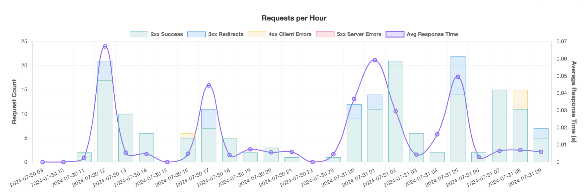
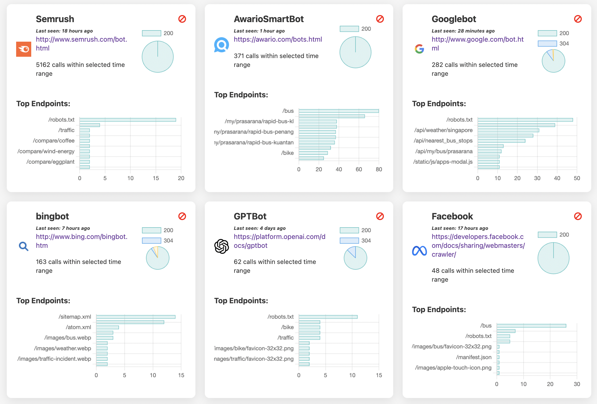
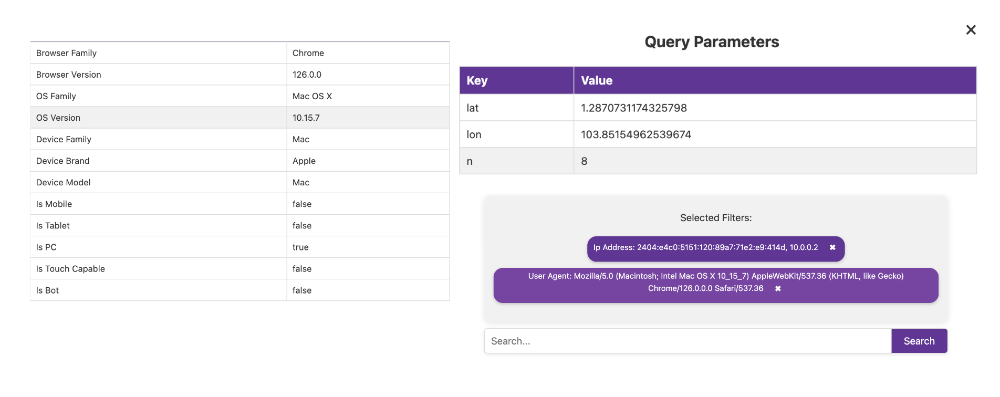
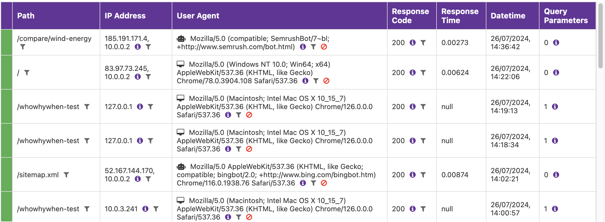

# WhoWhyWhen - FastAPI Middleware Analytics

<div align="center">
  
  <p>Open source API analytics and monitoring for developers</p>
</div>

WhoWhyWhen is an open source analytics platform that helps you track and understand your API usage. Built with FastAPI and Svelte, it provides comprehensive request tracking, bot detection, and performance monitoring for your APIs.

## Features

### Analytics & Monitoring
- **Request Tracking**: Log and analyze all API requests
- **Performance Metrics**: Response time tracking and statistical analysis
- **Error Monitoring**: Track and alert on 4xx/5xx errors
- **Bot Detection**: Identify and categorize bot traffic
- **User Agent Analysis**: Understand client device distribution

### Security
- **User Authentication**: Email + password and Google OAuth
- **Two-Factor Authentication**: TOTP-based 2FA support
- **API Key Management**: Create, revoke, and manage API keys
- **Role-Based Access**: Control access to projects and data

### Notifications
- **Customizable Alerts**: Set thresholds for errors and performance
- **Multi-Channel Notifications**: Email and web push notifications
- **Real-Time Updates**: Immediate alerts on critical issues

### Infrastructure
- **Self-Hosted**: Full control over your data and infrastructure
- **Containerized**: Easy deployment with Docker
- **Open Source**: Modify and extend to suit your needs

## Screenshots

<div align="center">
  <table>
    <tr>
      <td></td>
      <td></td>
    </tr>
    <tr>
      <td></td>
      <td></td>
    </tr>
  </table>
</div>

## Tech Stack

- **Backend**: 
  - [FastAPI](https://fastapi.tiangolo.com/) - High-performance API framework
  - [SQLModel](https://sqlmodel.tiangolo.com/) - Database ORM
  - [Alembic](https://alembic.sqlalchemy.org/) - Database migrations
  - [PostgreSQL](https://www.postgresql.org/) - Relational database
  - [Celery](https://docs.celeryq.dev/) - Task queue for background processing

- **Frontend**: 
  - [Svelte](https://svelte.dev/) - Component framework
  - [Chart.js](https://www.chartjs.org/) - Data visualization
  - [JavaScript](https://developer.mozilla.org/en-US/docs/Web/JavaScript) - Language

- **Authentication**: 
  - [JWT](https://jwt.io/) - Token-based authentication
  - [OAuth2](https://oauth.net/2/) - Third-party authentication
  - [TOTP](https://pyauth.github.io/pyotp/) - Two-factor authentication

- **Containerization**: 
  - [Docker](https://www.docker.com/) - Containerization
  - [Docker Compose](https://docs.docker.com/compose/) - Multi-container deployments

## Installation

### Prerequisites

- Python 3.8+
- PostgreSQL
- Node.js and npm/yarn

### Backend Setup

1. Clone the repository:
   ```bash
   git clone https://github.com/yourusername/whowhywhen.git
   cd whowhywhen
   ```

2. Create a virtual environment and install dependencies:
   ```bash
   python -m venv venv
   source venv/bin/activate  # On Windows: venv\Scripts\activate
   pip install -r requirements.txt
   ```

3. Create a `.env` file based on `.env.example`:
   ```bash
   cp .env.example .env
   # Edit .env with your configuration
   ```

4. Run database migrations:
   ```bash
   alembic upgrade head
   ```

5. Start the backend services:
   ```bash
   uvicorn app.main_api:app --reload --port 8001
   uvicorn app.main_dash:app --reload --port 8000
   ```

### Frontend Setup

1. Navigate to the frontend directory:
   ```bash
   cd who-why-when-landing-page
   ```

2. Install dependencies:
   ```bash
   npm install
   # or
   yarn install
   ```

3. Start the development server:
   ```bash
   npm run dev
   # or
   yarn dev
   ```

## Docker Deployment

You can also run the entire application using Docker:

```bash
docker-compose up -d
```

## Quick Start

The fastest way to get started is with Docker:

```bash
# Clone the repository
git clone https://github.com/navig-me/whowhywhen.git
cd whowhywhen

# Create and configure environment file
cp .env.example .env
# Edit .env with your settings

# Start the application
docker-compose up -d
```

Visit http://localhost:8000 to access the dashboard.

## Integration

Add the WhoWhyWhen middleware to your application to start tracking API usage:

### FastAPI

```python
from fastapi import FastAPI, Request
from datetime import datetime
import httpx

app = FastAPI()

@app.middleware("http")
async def track_requests(request: Request, call_next):
    # Record request start time
    start_time = datetime.now()
    
    # Process the request
    response = await call_next(request)
    
    # Calculate request duration
    duration = (datetime.now() - start_time).total_seconds()
    
    # Capture request details
    data = {
        "url": str(request.url),
        "method": request.method,
        "status_code": response.status_code,
        "duration": duration,
        "user_agent": request.headers.get("User-Agent"),
        "ip_address": request.client.host,
    }
    
    # Send analytics to WhoWhyWhen asynchronously (non-blocking)
    try:
        async with httpx.AsyncClient(timeout=2.0) as client:
            await client.post(
                "http://your-whowhywhen-instance:8001/api/log",
                headers={"X-API-KEY": "your-api-key"},
                json=data
            )
    except Exception:
        # Fail silently to avoid affecting the main application
        pass
    
    return response
```

### Express.js

```javascript
const axios = require('axios');

function whowhywhenMiddleware(apiKey) {
  return (req, res, next) => {
    const startTime = Date.now();
    
    // Store original end function
    const originalEnd = res.end;
    
    // Override end function to capture response details
    res.end = function(...args) {
      // Call original end function first
      originalEnd.apply(res, args);
      
      // Calculate duration
      const duration = (Date.now() - startTime) / 1000;
      
      // Send analytics (non-blocking)
      axios.post('http://your-whowhywhen-instance:8001/api/log', {
        url: req.originalUrl || req.url,
        method: req.method,
        status_code: res.statusCode,
        duration: duration,
        user_agent: req.headers['user-agent'] || '',
        ip_address: req.ip || req.connection.remoteAddress
      }, {
        headers: { 'X-API-KEY': apiKey },
        timeout: 2000
      }).catch(() => {
        // Fail silently
      });
    };
    
    next();
  };
}

// Add to your Express app
app.use(whowhywhenMiddleware('your-api-key'));
```

For more integration examples, see [INTEGRATION.md](docs/INTEGRATION.md).

## Contributing

Contributions are welcome! Here's how you can help:

- **Report bugs** by opening an issue
- **Suggest features** or improvements
- **Submit pull requests** to fix issues or add capabilities
- **Improve documentation** or add examples
- **Share your experience** using WhoWhyWhen

Please see [CONTRIBUTING.md](CONTRIBUTING.md) for detailed contribution guidelines.

## Documentation

- [Setup Guide](SETUP.md) - Detailed installation instructions
- [API Documentation](docs/API.md) - API endpoints reference
- [Integration Guide](docs/INTEGRATION.md) - How to integrate with different frameworks
- [Configuration](docs/CONFIGURATION.md) - Configuration options

## License

This project is licensed under the MIT License - see the [LICENSE](LICENSE) file for details.

## Acknowledgements

- [FastAPI](https://fastapi.tiangolo.com/) for the amazing API framework
- [Svelte](https://svelte.dev/) for the intuitive frontend framework
- All open source libraries and tools used in this project
- Contributors who have helped improve WhoWhyWhen

---

<div align="center">
  <p>Made with ❤️ by the WhoWhyWhen team</p>
  <p>
    <a href="https://github.com/navig-me/whowhywhen/stargazers">⭐ Star us on GitHub</a> •
    <a href="https://github.com/navig-me/whowhywhen/issues">🐛 Report Bug</a> •
    <a href="https://github.com/navig-me/whowhywhen/issues">✨ Request Feature</a>
  </p>
</div>